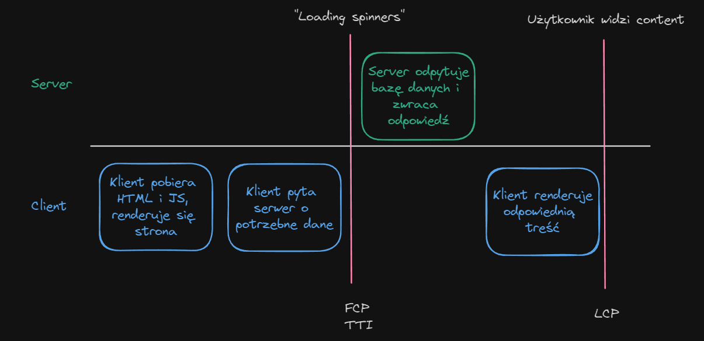
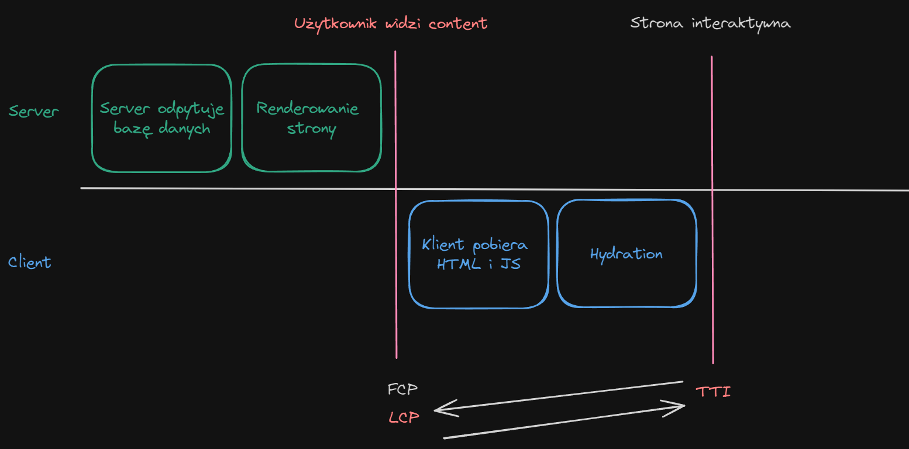

# It's evolving, just backwards?

Zanurkujmy w React Server Components

<div class="abs-br m-6 flex gap-2">
  <a href="https://github.com/rkarbowiak" target="_blank" alt="GitHub" title="Open in GitHub"
    class="text-xl slidev-icon-btn opacity-50 !border-none !hover:text-white">
    <carbon-logo-github />
  </a>
  <a href="https://www.linkedin.com/in/radoslaw-karbowiak/" target="_blank" alt="Linkedin" title="Open in Linkedin"
    class="text-xl slidev-icon-btn opacity-50 !border-none !hover:text-white">
    <carbon-logo-linkedin />
  </a>
</div>

---
layout: default
---

# Agenda

<div class="flex flex-col justify-between h-11/12">
  <ul>
    <li>Czym są React Server Components? </li>
    <li>W jaki sposób mają nam pomóc?</li>
    <li>Zalety i wady</li>
    <li>Kiedy SSR, a kiedy CSR?</li>
    <li>Podsumowanie</li>
  </ul>

  <div> PS: Na prezce będziemy używać głównie Next.js </div>
</div>

--- 
layout: default
---


## Zobaczmy jak przebiega renderowanie po stronie klienta



--- 
layout: center
---

## Minusy 

- Google nie zaindeksuje naszej strony
- Powolne ładowanie strony
- Bundle JS musi być pobrany i uruchomiony, duży wpływ wielkości bundle'a na czas ładowania
- Cache przeglądarki nie są wykorzystywane

--- 
layout: default
---

## Może by tak renderować po stronie serwera?



---
layout: center
---

# RSC pozwalają na renderowanie komponentów Reacta po stronie serwera.


---
layout: two-cols

---
## Client Component

```jsx {all} {lines:true}
function UserPage() {
  const [users, setUsers] = useState([]);

  useEffect(() => {
    fetch('/api/users')
      .then((res) => res.json())
      .then((data) => setUsers(data));
  }, []);

  return (
    <div>
      <h1>Users</h1>
      <ul>
        {users.map((user) => (
          <li key={user.userId}>{user.username}</li>
        ))}
      </ul>
    </div>
  );
}
```

:: right ::

## Server Component (Next.js)

```jsx {all|2|1} {lines:true}
export default async function UserPage() {
  const users = await getUsers();

  return (
    <div>
      <h1>Users</h1>
      <ul>
        {users.map((user) => (
          <li key={user.userId}>{user.username}</li>
        ))}
      </ul>
    </div>
  );
}
```

---
layout: two-cols

---
## Client Component

```jsx {lines:true}
function UserPage() {
  const [users, setUsers] = useState([]);

  useEffect(() => {
    fetch('/api/users')
      .then((res) => res.json())
      .then((data) => setUsers(data));
  }, []);

  return (
    <div>
      <h1>Users</h1>
      <ul>
        {users.map((user) => (
          <li key={user.userId}>{user.username}</li>
        ))}
      </ul>
    </div>
  );
}
```

:: right ::

## Server Component (Next.js)

```jsx {all|2-5} {lines:true}
export default async function UserPage() {
  const users = await sql`
    SELECT * FROM users
  `;

  return (
    <div>
      <h1>Users</h1>
      <ul>
        {users.map((user) => (
          <li key={user.userId}>{user.username}</li>
        ))}
      </ul>
    </div>
  );
}
```

---
layout: fact
---

## Demo


---
layout: default
---

## Cool! Dodajmy trochę logiki

```jsx {all} {lines:true}
export default async function UserPage() {
  const users = await sql`
    SELECT * FROM users
  `;

  const [selectedUser, setSelectedUser] = useState(null);

  return (
    <div>
      <h1>Users</h1>
      <ul>
        {users.map(user => (
          <li key={user.userId}>
            <p>{user.username}</p>
            <input
              type="checkbox"
              checked={selectedUser === user.userId}
              onChange={() => setSelectedUser(user.userId)}
            />
          </li>
        )}
      </ul>
    </div>
  );
}
```


---
layout: two-cols
---

## Zalety
- Szybsze ładowanie strony
- Google zaindeksuje naszą stronę
- Cache przeglądarki są wykorzystywane
- Mniejszy bundle JS

::right::

## Wady
- Nowy paradygmat
- Trudniejsze debugowanie i testowanie
- Nie wszystkie komponenty mogą być renderowane po stronie serwera
- Nie wszystkie biblioteki są kompatybilne